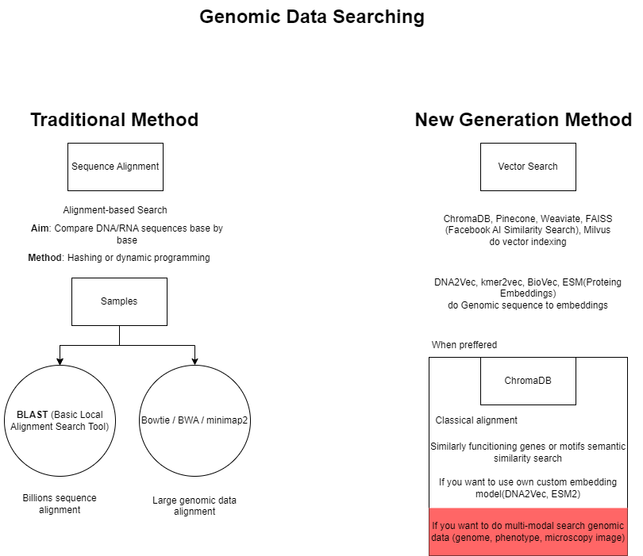

# Alignment-Based Genomic Search and Cancer Mutation Validation

## Abstract

This project implements a DNA sequence alignment-based validation system for identifying potential cancer-associated genetic mutations.  
It reproduces the classical bioinformatics alignment methodology—a foundational process in molecular diagnostics and translational oncology—by aligning patient-derived DNA fragments against reference cancer gene databases (BRCA1, TP53, KRAS).  

The goal is to detect and validate sequence variants (SNPs, insertions, deletions) that may indicate oncogenic mutations.  
This pipeline combines traditional algorithmic methods with modular Python analysis, serving as a foundation for integrating AI-driven genomic similarity search (e.g., DNA2Vec, ChromaDB).

---

## 🧬 Pipeline Diagram

Below is an overview of the genomic vector search architecture implemented in this project:




## Research Motivation

Cancer genomics relies on precise mutation detection and validation against known reference sequences.  
While deep learning and transformer-based genomic models are rapidly emerging, alignment-based search remains the most reliable baseline for genomic interpretation.  

This project aims to:
- Illustrate classical sequence alignment as used in scientific and industrial bioinformatics pipelines.  
- Demonstrate mutation-level validation using simulated patient data.  
- Establish a foundation for semantic genomics (vector-based search) in future work.

---

## Methodology

### Data Retrieval
Three canonical cancer-related genes were fetched directly from NCBI RefSeq using BioPython:

| Gene | Accession | Function |
|------|------------|-----------|
| BRCA1 | NM_007294.4 | DNA repair-associated tumor suppressor |
| TP53 | NM_000546.6 | Central regulator of apoptosis and cell cycle arrest |
| KRAS | NM_004985.5 | Proto-oncogene, key regulator in signal transduction |

### Database Construction
A local nucleotide database was built using NCBI BLAST+:
```bash
makeblastdb -in cancer_reference_genes.fasta -dbtype nucl -out cancer_ref_db
```
This enabled direct local comparison between patient sequences and reference genes.

### Mutation Simulation
Synthetic cancer-like DNA fragments were generated from BRCA1 by introducing:
1. Point mutation (G→T substitution)  
2. Single-base deletion  
3. Two-base insertion (CC)  

Resulting in a 120 bp *in silico* patient sequence mimicking a pathogenic variant.

### Sequence Alignment
Alignment and validation were performed via:
```bash
blastn -query patient_sample.fasta -db cancer_ref_db -out results.txt -outfmt "6 qseqid sseqid pident length mismatches gaps bitscore evalue"
```

The output was parsed using pandas and analyzed for variant interpretation metrics.

---

## Validation Metrics

| Metric | Description |
|---------|-------------|
| % Identity | Percentage of identical nucleotide matches |
| Alignment Length | Total aligned base pairs |
| Mismatches / Gaps | Reflects substitutions, deletions, and insertions |
| E-value | Probability that the match occurred by chance |
| Bitscore | Statistical confidence of the alignment |

Interpretation model:
- ≥ 99% → Reference match (Normal)  
- 95–99% → Benign or mild variant  
- < 95% → Potential pathogenic mutation

---

## Example Result

| Query_ID | Matched_Gene | Identity(%) | Alignment_Length | Mismatches | Gaps | Interpretation |
|-----------|---------------|--------------|------------------|-------------|-------|----------------|
| Patient_BRCA1_mut120 | NM_007294.4 | 96.7 | 120 | 3 | 1 | Potential cancer mutation |

This shows that simulated mutations reduce the % identity, confirming the system’s capability to detect structural variation.

---

## Tools and Framework

| Tool | Purpose |
|------|----------|
| Python 3.10+ | Core environment |
| BioPython | NCBI data retrieval, FASTA/SeqRecord handling |
| NCBI BLAST+ | Alignment and database creation |
| pandas | Post-processing and data analytics |
| Google Colab / Linux Shell | Execution environment for large-scale tests |

---

## Applications

- Pre-screening of synthetic and experimental genomic datasets  
- Educational and demonstrative framework for Bioinformatics Scientist positions  
- Validation step prior to AI-based genomic embedding and similarity search  
- Research pipeline alignment with translational genomics and molecular oncology laboratories (e.g., BioNTech, EMBL)

---

## Future Work

- Integration with ClinVar and COSMIC mutation repositories for known variant cross-referencing.  
- Expansion to vector-based sequence similarity using DNA2Vec / kmer2vec.  
- Integration of ChromaDB for semantic genomic search and rapid mutation clustering.  
- Deployment on HPC or cloud-based environments for large-scale genomic screening.

---

## References

- Altschul, S. F. et al. (1990). Basic Local Alignment Search Tool (BLAST). *Journal of Molecular Biology*, 215(3), 403–410.  
- NCBI RefSeq Database. https://www.ncbi.nlm.nih.gov/refseq/  
- COSMIC: Catalogue of Somatic Mutations in Cancer.  
- ClinVar: NIH Genetic
  
